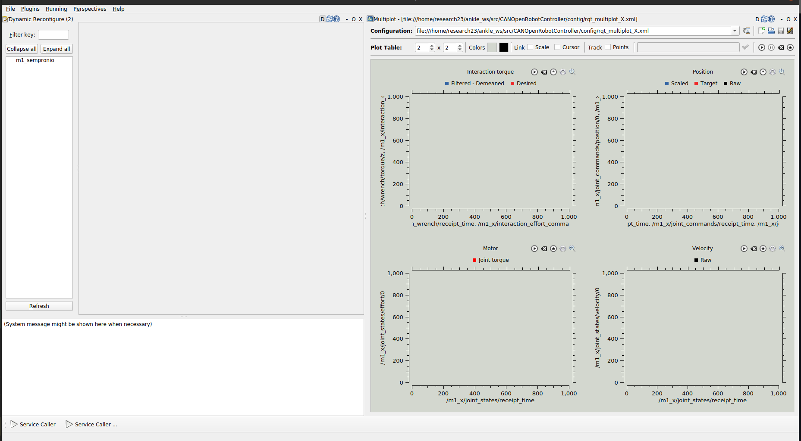
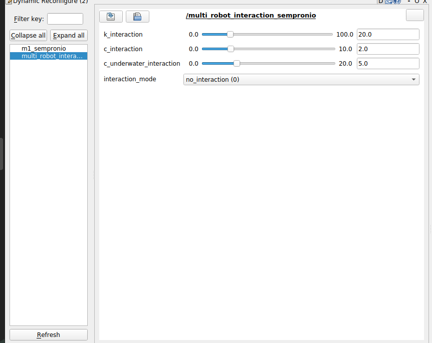

# multi_robot_interaction
## Rehab Week 2025 workshop 
This repo is to create haptic interaction between multi-robot systems in python. 

Across the workshop we will perform 3 tasks:
- Task 1: Connect the robot, test transparency, Visualize the task, implement viscous friction.
- Task 2: Connect your robot to another robot and perceive forces due to the virtual interaction.
- Task 3: Connect multiple robots (>2) and play with the interaction

## Before starting: 
- Most of the computers run in  a local network so if you need to search online we suggest to keep the your personal computer close. 
- All the task will be in python, if you are not familiar with python here a list of helpfull commands:
  ```python
    # for cycle has the following notation:
    # where i is an index that goes from 0 to len(v) where len(v) is the dimension of a vector
    for i in range(0, len(v)): # both for loop and if operator want : at the end and space in the next line
      if v[i] == N: # if operator, equal operator in python (==), to access element i of vector v[i]
          L = v[i] # no ; needed
    # numpy array:
    v = np.array([1, 2, 4,3])
    # to have size of single dimension array
    v.shape[0]
  ```


## Start Robot Node 

Understand you team name: 
**The team name should be handwritten on the upper part of the screen, this will be the name of your paddle across the whole workshop. 
IMPORTANT: Don't confuse it with other names.**

Run the robot node: 
A terminal splitted in two should be already open. 
If you click on the upper one and use the up-arrow you should find the following command line:

```sh 
roslaunch CORC m1_real_A.launch
```
At this point you should see something like:

If this is not the case (any red part raise your hand).

Now try to move the robot, it should be quite hard to manuver because no torque are provided by the motor. 

## Test robot transparency 
At the opening of the node a (rqt-)**GUI** should open (if this is not the case raise your hand). 
The GUI should be similar to this one:



If you press to the name of your team on the left of the GUI the following interface should open.

At this point press on the scrollable bar in the "Controller mode" and press on transparent mode. 


The robot should be much easier to move because the robot controller performs the following:


For the following task you have to immagine the robot as a joystick that controls a paddle in a boat game.


(Organizers run the boat game)

On the GUI you can also visualize the name of the other teams.** Pay attention of not pressing other teams names.**

For the next part of the workshop we will need to visualize what it is happening inside each robot.
For this reason on the right part of the guy are displayed some plots. 

These plots display:
- the joint configuration of the robots, 
- the desired interaction torque with the user

For this first task the interaction torque is zero so if you press play you should only see the joint positions of all four robots. 


## Task 1: Implement water viscousity when paddle enter in contact with water


For this first task you will need to implement the water viscousity. 
First of all **bring back the robot controller to zero torque. **

There should be Visual Studio open in your screen with the script "**compute_torque.py**" open. 
In this script there are three function we will implement across the whole workshop. 
For the first we will concetrate on the first function:

```python
"""
Task 1: apply water viscorisity to robot motion
-----------------------------------------------
The viscosity is applied only for negative velocities
and it's proportional to the current velocity multiplied by a
damping component
"""
def apply_water_viscosity(D_vis, pos, vel):
    """
    D_vis: water damping
    pos: current velocitity
    vel: current velocity
    -> returns F: force due to viscosity
    """
    F=0
    # todo
    return F
```

we would like you to implement a viscous force that is designed in this way:

$$\large F = - D_{vis} \dot{\theta} \text{ for } \dot{\theta} \leq 0 \wedge \theta \leq 0 $$

Now save the script and go back on the terminal. 
In a second terminal (lower one) if you use your up-arrow you should find the following command line:

```sh
roslaunch multi_robot_interaction multi_m1_real.launch
``` 

At this point on the GUI should appear on the left an additional node : "**multi_robot_interaction_$TEAMNAME**". 
If you don't see press **Refresh**. 
Pay attention to select your own team name. 
The following interface should open:



Before testing the actual forces on the robot check on the plots the results of that forces:
**If you implemented the friction correctly you you see some peaks of desired interaction force when you move the robot toward down direction. 
These peaks should appear only after the robot goes over the middle point ($\large \theta=0$) and their amplitude should be proportional to the velocity you are moving the robot.** 

If All these are true we are ready to test the effect of that force on the robot. 
Otherwise ```sh ctrl + c``` on the lower terminal and comeback to the code. 

On the GUI select "Task1WaterViscousity(1)" in the "interaction_mode" scroll bar menu. 


Now come back to your robot menu and select "interaction_torque_controller(4)" in the controller mode. 


Now if you try to move the robot you should perceive water viscousity.

### Try to change the damping parameter on the multi_robot_menu. 


- How the force you perceive will change?

## Task 2: Implement connection to a second robot


Now that we have an understanding of how each robot works locally and what features it implements let's raise a bit the bar. 

First of all:
- **Bring the robot to zero_torque**
- Close the multi_robot_interaction node by pressing ctrl+c on the lower terminal

Comeback to Visual-Studio and let's concentrate on the second function:

```python
"""
Task 2: compute interaction forces due to virtual
interaction with a second robot
-------------------------------------------------
....
"""
def apply_connection_forces_two_robots(K_int , D_int, posA, posB, velA, velB):
    """
    ...
    """
    #TODO
    return F_A
```

Here we would like you to implement a force proportional to the differences in joint positions and velocities ($\theta_A, \theta_B, \dot{\theta}_A, \dot{\theta}_B$) between your robot ($A$) and a second robot ($B$). 

The force should be modeled as a spring-damper system such that the force the robot B exerts on robot A ($^BF_A$) is equal to:

$$\large ^BF_A = K(\theta_B - \theta_A) + D(\dot{\theta}_B- \dot{\theta}_A)$$

For this task ask the team next to you their name and their robot will be the one you will interact with (the name is already inside the code you will not need to specify it anyway). 

Once you implemented the function run the following:

```sh
roslaunch multi_robot_interaction multi_m1_real.launch task:=2
```

Doing that each team implements a interaction force for their robot. So if only one team implement it we will have a **unidirection interaction**, when both teams implement the function we will have a **bilateral interaction**. 
** If you have to guess (in the hypothesis that both of you created the same function in the same way and with the same parameters) what force should the other robot measures?**


First of all, change the interaction_mode in the multi_robot_menu and set as Task2RobotConnection(2).

Now observe the plots, if you press play you should see:
- if you move your robot far from the other robot configuration the desired interaction force grows. 
- if the two robot are very close to each other there should be zero interaction torque.

If all these are true we are able to test on the robot otherwise close the node and comeback to VS code. 

Move to your robot menu and select interaction_torque_control(4).

### Now let's play a bit with the parameters of the interaction. 
- **What happen if you increase or decrese the stiffness?**
- **What happen if one robot increase the stiffness and the $other robot decrease it? **
- **When this can be helpfull?**

## Task 3: Connect more than 2 robots

Now we saw: 

(1) how each robot behaves individually. 

(2) how two robots interact. 

Let's try something more challenging: Connecting more than 2 robots.

First of all:
- **Bring the robot to zero_torque**
- Close the multi_robot_interaction node by pressing **ctrl+c** on the lower terminal

Go back to Visual Studio and implement the third function:

```python 
"""
Task 3: compute interaction forces due to virtual
interaction with N robots
-------------------------------------------------
....
"""
def apply_connection_forces_N_robots(K_int , D_int, pos_v, vel_v, conn_Vector):
    """
    K_int : stiffness connecting two robots [int]
    D_int : damping connecting two robots [int]
    pos_v : vector of robots positions [N dim np array, where N is the number of robots]
    vel_v : vector of robots velocities [N dim np array]
    conn_Vector : vector (N numpy array) describing the interaction between robots
        The vector contains only 1s and 0s, if the element at the 
        index i == 1 the the robot 0 is connected to the robot i (not viceversa)
        The robots should never be connected to themself, so the elements at (0) == 0
    returns-> a force F containing the sum of all forces experienced for by the robot 0 due to connection
    """
    F = 0.0
    # TODO
    return F
```

This function should return a sum of the forces exerted from each robot having 0 as vector index on our robot 

$$\large ^BF_A = \frac{K}{(\sum_i s_i)^2}(\theta_B - \theta_A) + \frac{D}{\sum_i s_i}(\dot{\theta}_B- \dot{\theta}_A)$$

$$\large F = \sum_i s_i ^iF_A  \text{ with } s_i \in \{0, 1\}$$

When the function is ready save and go back on the terminal and run:
```sh
roslaunch multi_robot_interaction multi_m1_real.launch task:=3
```
On the opening a interactive window should opening with the following graphical interace:


This interface allows to associate your robot (on the left) to as many of the other robots present in the room. 
To connect your robot to another robot just click on the robot you want to connect and drag and drop on the first line at the right of your robot. 
The position is not important. 
Doing that we are creating the vector then used in the function you just implemented. 
To start drag and drop two robot on the right of your robot (better from two teams near to you). 

When u are satisfied of the connection you implemented close the graphical window and go back on the GUI. 

In interaction_mode select "Task3". Let's visualize the results of the connection you implemented. 

The plots should display a torque that is proportional to the displacement from the two robots.

- **What happens in the case in which your robot is in the middle of the other two robots ?**

If All this is true you are ready to test with the actual robot.

We suggest to lower the stiffness and damping (**why?**)
Go to the robot menu and select interaction_mode(4). 

Now try to close the multi_robot_interaction node and open again with the same command and try to add additional robots. 
- What will happen if you connect all 8 of them ? 
