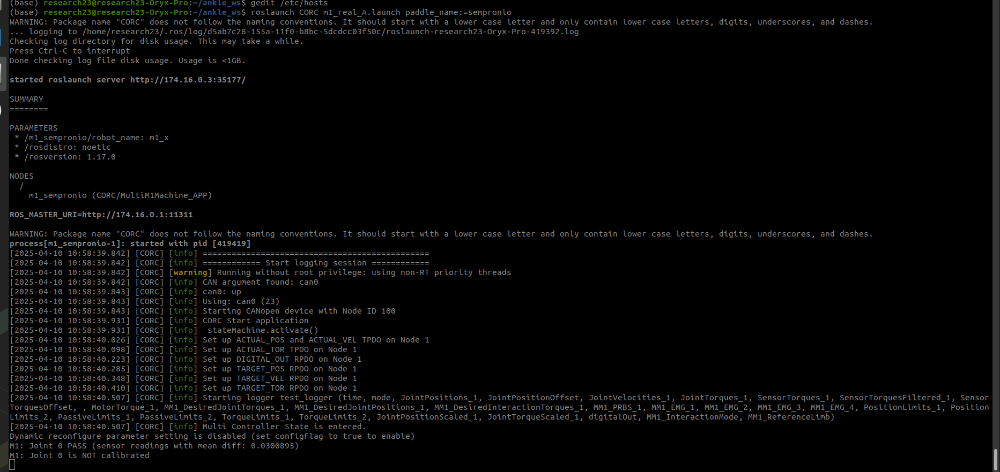
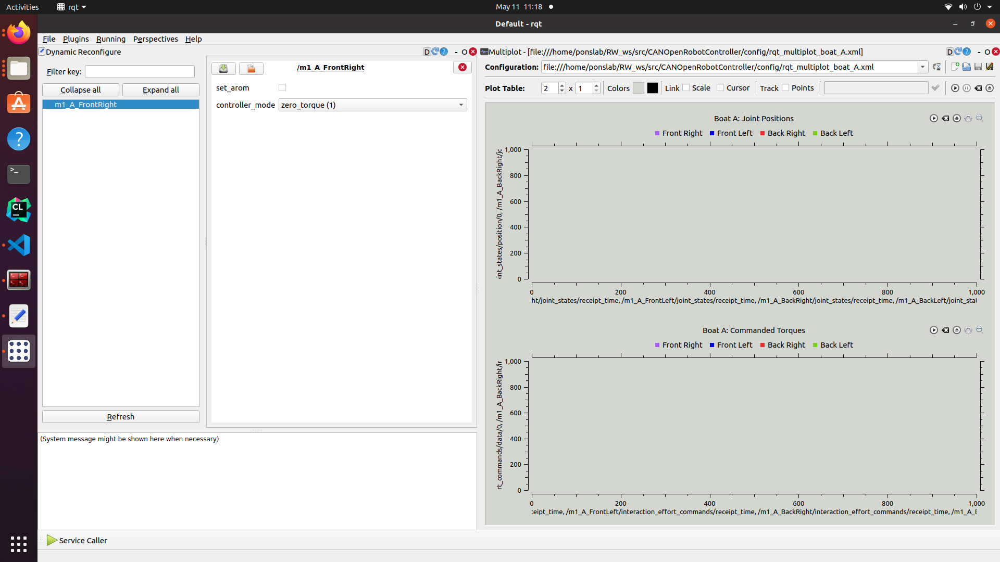
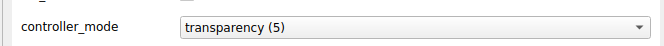
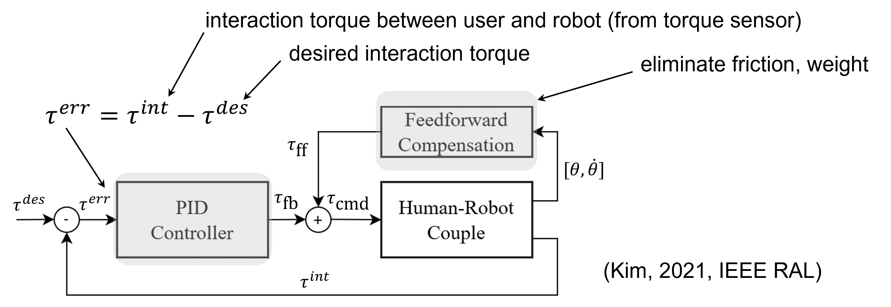
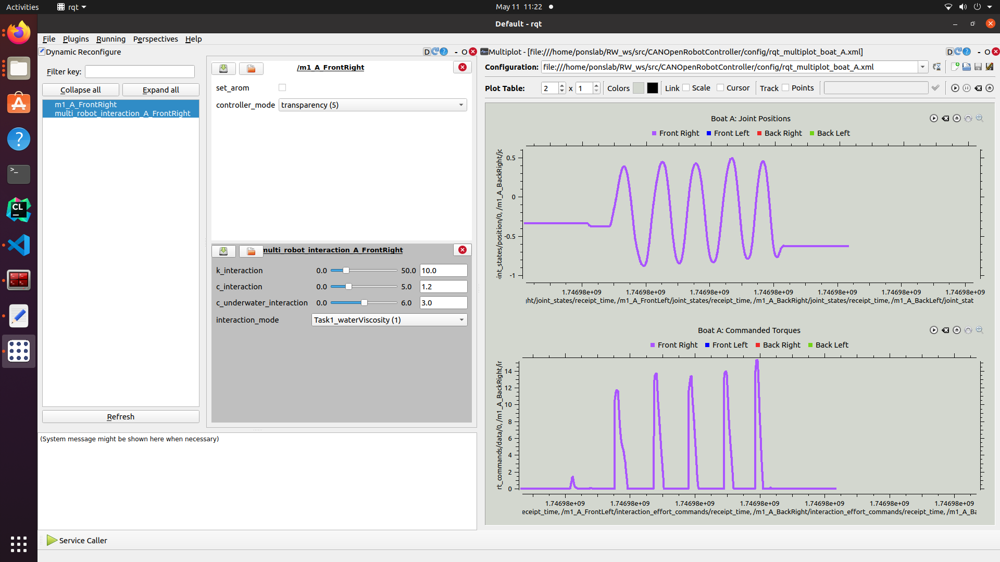
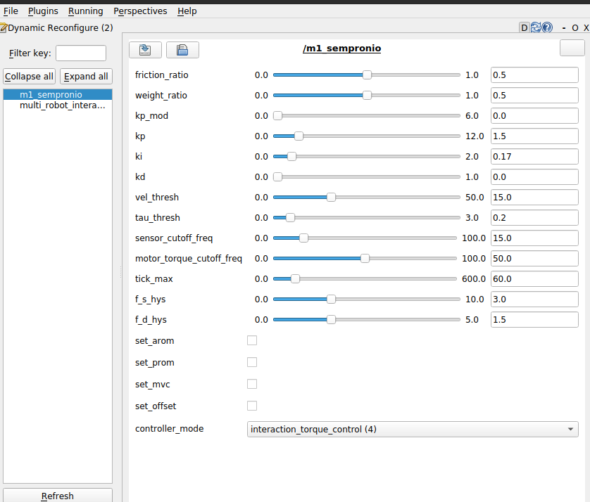
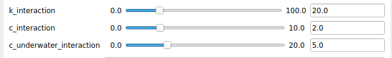
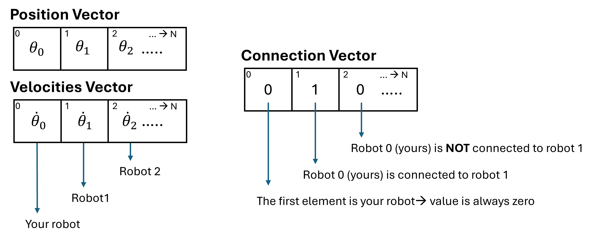

# RehabWeek 2025: WS32 
This repo covers an activity to render haptic forces between multi-robot systems in python. 
This activity is paired with a rehabilitation game, where the velocity of each single-DoF robot moves one of four paddles on a virtual boat.

Throughout the workshop we will perform 3 tasks:
- Task 1: Run the robot, test transparent control, visualize the task, implement viscous friction to simulate underwater forces.
- Task 2: Virtually connect your robot to another robot and perceive forces due to the haptic interaction.
- Task 3: Virtually connect more than two robots and play with the interaction parameters.


## Notes before starting: 
Most of the computers run on a local network, so if you need to search online we suggest that you use your personal computer.

## Python Instructions

All the task will be in python, if you are not familiar with python here a list of helpfull commands:
  ```python
    # for cycle has the following notation:
    # where i is an index that goes from 0 to len(v) where len(v) is the dimension of a vector
    for i in range(0, len(v)): # both for loop and if operator want : at the end and space in the next line
      if v[i] == N: # if operator, equal operator in python (==), to access element i of vector v[i]
          L = v[i] # no ; needed
    # numpy array:
    v = np.array([1, 2, 4,3])
    # to have size of single dimension array
    v.shape[0]
  ```


## Start Robot Node 

Understand you team name: 
**The team name should be handwritten on the upper part of the screen, this will be the name of your paddle across the whole workshop. 
IMPORTANT: Don't confuse it with other names.**

Run the robot node: 
A terminal split in two should be already open. 
If you click on the upper window and press the up-arrow key, you should find and run the following command line:

```sh 
roslaunch CORC m1_real_A.launch
```
At this point you should see something like:

If this is not the case (any red part raise your hand).

Now try to move the robot. You should feel a lot of resistance because no torque compensation is provided by the motor. 

## Test robot transparency 
After running the robot node, an (rqt-)**GUI** should also open (if this is not the case raise your hand). 
The GUI should be similar to this one:



If you click on the name of your team on the left of the GUI, the following interface should open.

At this point, click on the dropdown labeled "Controller mode" and switch to transparent mode. 



The robot should be much easier to move because the controller attempts to minimize the forces read by the interaction force sensor. For more details, the interaction force controller performs the following:



For the following tasks, you should think about the robot as a joystick that controls a paddle of virtual boat.


(Organizers run the boat game)

On the GUI, you can also visualize the name of the other teams. **Pay attention NOT to click the other team names.**

For the next part of the activity, we will need to visualize the sensor data and commands streaming from your robot.
On the right part of the GUI, we display some important plots. 

These plots display:
- the joint configuration of the robots (i.e., angular position), 
- the desired interaction torque with the user

For this first task, the desired interaction force is zero. If you press play, you should only see the joint angles of all four robots. 

## Task 1: Implement water viscousity when paddle contact with water


For this first task, you will need to render non-zero torques on your robot to simulate the feeling of moving a paddle through water. 
First, **change the robot Controller Mode back to zero_torque.**

There should be Visual Studio window on your screen with the script "**compute_torque.py**" open. 
In this script, there are three function we will implement across the three tasks of the workshop. 
For the first, we will concetrate on this function:

```python
"""
Task 1: apply water viscorisity to robot motion
-----------------------------------------------
The viscosity is applied only for negative velocities
and it's proportional to the current velocity multiplied by a
damping component
"""
def apply_water_viscosity(D_vis, pos, vel):
    """
    D_vis: water damping
    pos: current velocitity
    vel: current velocity
    -> returns F: force due to viscosity
    """
    F=0
    # todo
    return F
```

we would like you to implement a viscous force that is designed in this way:

$$\large F = - D_{vis} \dot{\theta} \text{ for } \dot{\theta} \leq 0 \wedge \theta \leq 0 $$

Now save the script (```sh ctrl + s```) and go back on the terminal. 
In a second terminal (bottom one) if you use your up-arrow you should find and run the following command line:

```sh
roslaunch multi_robot_interaction multi_m1_real.launch
``` 
At this point an additional node should appear on GUI : "**multi_robot_interaction_$TEAMNAME**". 
If you don't see this on the GUI, press **Refresh**. 
Again, pay attention to select your own team name. 
The following interface should open:



### Visualize implemented forces

For safety, before physically testing the actual commanded forces on the robot, check the plots on the right to see what forces you've computed based on the joint configuration of your robot:
**If you implemented the viscosity correctly, you you see some peaks of desired interaction force when you move the robot downward. 
These peaks should appear only after the robot passes below the middle point ($\large \theta=0$); the amplitude of the forces should be proportional to the velocity you are moving the robot.** 

If all these are true, we are ready to physically test the result these commanded forces on the robot. 
Otherwise ```sh ctrl + c``` on the bottom terminal and modify your code in Visual Studio to the code. 

On the GUI select "Task1WaterViscousity(1)" in the "interaction_mode" scroll bar menu. 


Now come back to your robot menu and select "interaction_torque_controller(4)" in the controller mode. 



Now if you try to move the robot you should perceive water viscousity.

### Try to change the damping parameter on the multi_robot_menu. 



- How the force you perceive will change?

## Task 2: Implement connection to a second robot


Now that we have an understanding of how each robot works locally and what features it implements let's raise the bar a bit. 

First of all:
- **Change the robot Controller Mode to zero_torque**
- Close the multi_robot_interaction node by pressing ```sh ctrl + c``` on the bottom terminal

Come back to Visual Studio and let's focus on the second function:

```python
"""
Task 2: compute interaction forces due to virtual
interaction with a second robot:
-------------------------------------------------
The function receives as input, the joint position and velocity of your current robot (posA) and of the robot next to yours (posB, velB), the stiffness and damping of the virtual connection (K_int, D_int).
The same function returns the interaction force your robot implements (F_A). All values (pos, vel, K, D, F) are single values. K, D positive, pos and vel in radians.  
"""
def apply_connection_forces_two_robots(K_int , D_int, posA, posB, velA, velB):
    """
    ...
    """
    #TODO
    return F_A
```

Here we would like you to implement a force proportional to the differences in joint positions and velocities ($\theta_A, \theta_B, \dot{\theta}_A, \dot{\theta}_B$) between your robot ($A$) and a second robot ($B$). 

The force should be modeled as a spring-damper system such that the force the robot B exerts on robot A ($^BF_A$) is equal to:

$$\large ^BF_A = K(\theta_B - \theta_A) + D(\dot{\theta}_B- \dot{\theta}_A)$$

**For this task interact with the team next to yours**. Their robot will be the one you will interact with (the name is already inside the code you will not need to specify it). 

Once you implemented the function save (in VS: ```sh ctrl + s```) and run the following:

```sh
roslaunch multi_robot_interaction multi_m1_real.launch task:=2
```
Each team computes the desired connection forces for their own robot, relative to their neighbor's robot. If only one team implements these forces, we will have a **unidirectional interaction** (i.e., one-way connection); when both teams implement the function, we will have a **bidirectional interaction** (i.e., two-way connection). 
** If you have to guess, assuming that both of you created the same function in the same way and with the same parameters, what force should your neighbor's robot command (relative to your force commands)?**

Next, change the interaction_mode in the multi_robot_interaction menu to Task2RobotConnection(2).

Now observe the plots, if you press play you should see:
- if you move your robot far from the other robot configuration, the desired interaction force grows. 
- if the joint configurations of both robots are very close to one another, there should be near-zero interaction force.

If all these are true, we are able to test on the robot. Otherwise, close the node and come back to the Visual Studio code. 

Move to your robot menu and select interaction_torque_control(4).

### Now let's play a bit with the parameters of the interaction. 
- **What happens if you increase or decrease the stiffness?**
- **What happens if one robot increases the stiffness and the $other robot decreases it? **
- **In a rehabilitation scenario, when can these different stiffness settings be helpful?**

(Alessia Noccaro)

## Task 3: Connect more than 2 robots

At this point, we've seen: 

(1) how each robot behaves individually. 

(2) how two robots can virtually interact. 

Let's try something more challenging: connecting more than 2 robots.

First of all:
- **Change the robot Controller Mode to zero_torque**
- Close the multi_robot_interaction node by pressing ```sh ctrl + c``` on the bottom terminal

Go back to Visual Studio and implement the third Task. 
Let's suppose that we have the following arrays (numpy arrays):
- Positions of all robots (dim N = number of robots)
- Velocities of all robots (dim N) 
- Vector describing how the robots are connected (dim N)



Go back to Visual Studio and implement the third function that implement a connection between the robots:

```python 
"""
Task 3: compute interaction forces due to virtual
interaction with N robots
-------------------------------------------------
"""
def apply_connection_forces_N_robots(K_int , D_int, pos_v, vel_v, conn_Vector):
    """
    K_int : stiffness connecting two robots [float]
    D_int : damping connecting two robots [float]
    pos_v : vector of robots positions [N dim np array, where N is the number of robots]
    vel_v : vector of robots velocities [N dim np array]
    conn_Vector : vector (N numpy array) describing the interaction between robots
        The vector contains only 1s and 0s, if the element at the 
        index i == 1 the the robot 0 is connected to the robot i (not viceversa)
        The robots should never be connected to themself, so the elements at (0) == 0
    returns-> a force F containing the sum of all forces experienced for by the robot 0 due to connection
    """
    F = 0.0
    # TODO
    return F
```

This function should return a sum of the forces exerted from each robot having 0 as vector index on our robot 

$$\large ^BF_A = \frac{K}{(\sum_i s_i)^2}(\theta_B - \theta_A) + \frac{D}{\sum_i s_i}(\dot{\theta}_B- \dot{\theta}_A)$$

$$\large F = \sum_i s_i ^iF_A  \text{ with } s_i \in \{0, 1\}$$

When the function is ready save and go back on the terminal and run:
```sh
roslaunch multi_robot_interaction multi_m1_real.launch task:=3
```
On the opening a interactive window should opening with the following graphical interace:


This interface allows to associate your robot (on the left) to as many of the other robots present in the room. 
To connect your robot to another robot, just click on the robot you want to connect and drag/drop on the first line to the right of your robot name. 
The order is not important in this case. 
This creates the boolean connection vector (conn_Vector) used in the function you just implemented. 
To start, drag and drop two robots on the right of your robot (the other robots of your Boat A or B). 

When you are satisfied with the connection vector you implemented, close the graphical window and go back to the GUI. 

Change the interaction_mode to "Task3". Let's visualize the results of the connection you implemented. 

The plots should display a torque that is proportional to the displacement between the two robots.

If All this is true you are ready to test with the actual robot.

Go to the robot menu and select interaction_mode(4). 

Now try to close the multi_robot_interaction node and open again with the same command and try to add additional robots. 
- **What happens in the case in which your robot is in the middle of the other two robots ?**
- **What is the position of the attractor of the spring-damper when multiple robots are connected?**
